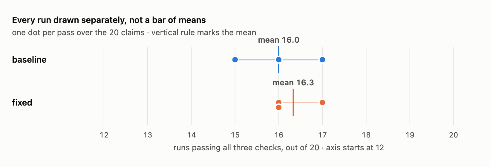
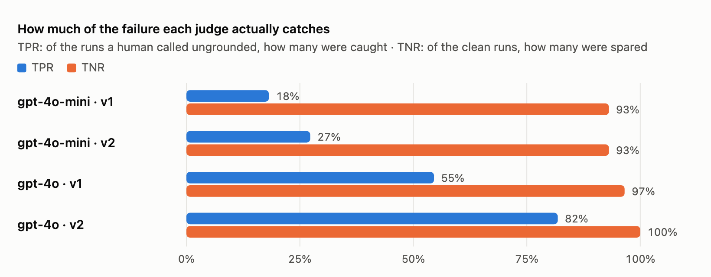

\vspace{-0.5em}

**Subject** — the Week 3 SEC Claim Auditor: a Google ADK agent that takes a
numeric claim about a public company, looks up what that company actually filed
with the US SEC, and returns one of four verdicts.

**Dashboard** — <https://week4-evals.onrender.com> (free tier; first load ~1 min)

**Repository** — <https://github.com/taj771/AI-Internship> →
`ai-engineering-bootcamp-v2/week-4/`

# Summary

Twenty claims written to break the agent, with every SEC figure established by
hand before any run. Every run recorded, all twenty read by hand before any
category existed, six failure types named and ranked, three deterministic checks
written against failures actually observed, one instruction rewritten, and then
enough repeats to find out whether the rewrite did anything.

It did not, measurably. The rewrite scores 16.3/20 against the baseline's
16.0/20, and the unchanged baseline scores 15, 16 and 17 across three runs. The
improvement is smaller than the measurement error.

Three findings are worth more than the pass rate:

1. **Two faults were found before the model ran at all**, by calling the tool by
   hand. One makes an entire class of claim unanswerable; the other silently
   audits the wrong company.
2. **The first draft of the fix caused a regression that the checks approved**,
   because the check had been given the same misconception as the rule.
3. **An LLM judge built to automate part of the review scored exactly what a
   constant function scores** on the agreement metric, while missing 9 of 11
   real failures.

# Method

## The claim set

Twenty claims, each targeting one specific suspected weakness rather than
sampling what arrives in practice: a company that files revenue under an unusual
tag, a non-December fiscal year, a year not yet reported, a claim quoting a
division's revenue as the firm's, a private company, a claim naming no company
at all, and a prompt injection.

Expected verdicts were established by calling `sec_tool.lookup_filed_figure`
directly with the model switched off, and are recorded per claim in `claims.py`
alongside the weakness each claim probes. This matters more than it appears: had
the expected verdicts come from the agent's own answers, the evaluation would
have been marking its own homework and every consistent mistake would have
scored as correct.

## Recording

Week 3's agent produced a full account of its own reasoning, drew it on a page,
and discarded it when the process ended. Week 4 writes one JSON object per run
to a JSONL file: the claim, every tool call with its exact arguments, every tool
result untruncated, the final answer, and the parsed five fields.

One field was added that changed the analysis. Each step records **which model
turn it belonged to**, which distinguishes two behaviours that are identical in
any summary: two tool calls issued in the same turn, before either result
existed, versus a second call chosen after reading the first result. Both print
"2 lookups". Only the second is the agent reasoning.

## Reading

All twenty runs were read one at a time with free-text notes and a binary
pass/fail, before any category existed. A run fails if any of the following is
true, regardless of whether the verdict is right:

- the verdict disagrees with the hand-established answer
- a figure in the answer came from somewhere other than a tool result
- it broke one of the rules in its own instruction
- it stopped while the tool had told it where to look next

Baseline: **12 pass, 8 fail.**

The last criterion is why a correct verdict can still fail. One run reaches the
right answer by asserting that no alternative definition exists, without
looking; another does exactly the same and is wrong. Grading only the verdict
scores the first as a success and learns nothing from the second.

# Findings

## Failure taxonomy

Impact is what the reader of the answer suffers: **3** actively misled,
**2** no usable answer, **1** the answer is sound and the working is not.

| # | Failure | Runs | Freq | Impact | Score |
|---|---------|------|------|--------|-------|
| F1 | Tag search abandoned or misdirected | C05, C06 | 2 | 2 | 4 |
| F2 | Required answer format abandoned | C21, C22 | 2 | 2 | 4 |
| F3 | Wrong company audited, undetected | C17 | 1 | 3 | 3 |
| F4 | Verdict ruled without testing the alternative | C09 | 1 | 3 | 3 |
| F5 | Tool evidence dropped from the answer | C10 | 1 | 2 | 2 |
| F6 | Answered with no tool call at all | C19 | 1 | 2 | 2 |

F4's visible frequency understates it. Two further runs *pass* while making the
same unsupported assertion that no alternative definition exists; three runs
reason that way and one produced a wrong answer.

## Two faults found without the model

**The tool cannot return any balance-sheet figure, for any company.**
`_annual_entries` keeps only facts spanning 350–380 days. A balance-sheet fact
has no span at all — the SEC returns `start: null`, because total assets is a
position on a date rather than a flow over a year. Every `Assets` and
`StockholdersEquity` lookup therefore fails as `no_annual_data`, and the agent's
own instruction recommends both tags.

**Company resolution silently returns a different filer.**
`resolve_company("Coca-Cola")` returns COCA-COLA EUROPACIFIC PARTNERS plc, a UK
bottler; `"Coca Cola"` without the hyphen resolves correctly. One run spent
three lookups auditing the wrong company, with the wrong name printed in every
observation it read and nothing in the output to indicate it. `"XOM"` returns
ExxonMobil Holdings Corp rather than Exxon Mobil Corp.

Neither is fixed in this week's work. Both are faults in the tool rather than in
the instruction, and changing the tool in the same step as the instruction would
have made the measured movement unattributable.

## The retry behaviour that mostly does not happen

The Week 3 write-up describes the agent reading a failed lookup and choosing the
next tag from the suggestions returned with the failure. Across twenty runs:

```
runs making more than one lookup      8
  of those, hedged (same turn)        7
  genuine sequential retry            1   <- the wrong-company run
runs making exactly one lookup        9
runs making none                      3
```

Seven of eight multi-lookup runs issued both tags in a single turn, before
either result existed — a hedge, not a decision. It is harmless in six of the
seven; in the seventh it consumed two of a three-call budget before the agent
knew anything and directly caused that failure.

It is recorded as a **risk factor** rather than a failure type. Counting it as a
failure would give it the highest raw frequency × impact score in the taxonomy
while describing behaviour that mostly works.

# Codified checks

Three deterministic checks, no model and no network, roughly 0.1 s for the
whole set. Each is tied to a failure observed in the traces.

| Check | Rule | Catches |
|-------|------|---------|
| `answer_format` | five fields present, verdict one of the four allowed | C21, C22 |
| `evidence_exists` | at least one tool call was made | C19, C21, C22 |
| `contradicted_was_searched` | CONTRADICTED on a claim within 2× the filed figure must have tested an alternative tag afterwards | C09 |

They catch four of the eight failures found by hand. The other four — chose
badly from a suggestion list, dropped a restatement, audited a UK bottler — need
somebody who knows what the numbers mean. A suite claiming to catch all eight
would be lying about the four it cannot.

**Both first drafts flagged runs a human had passed.** One required the filed
figure to appear verbatim in a tool result, and a correct run had converted
units, writing `$94,950 million` where the tool said `$94.95B`. The other
required a search before every CONTRADICTED verdict, which flagged a correct run
whose claim was four times the filed figure. Money is now compared numerically,
and the search requirement carries a size condition. Both corrections are pinned
by tests in `test_checks.py`.

# The fix, and why it cannot be claimed

The instruction was rewritten to address F2, F4 and F6: always answer in the
five-line format and never reply with a question; never answer without at least
one tool call; test an alternative tag before ruling CONTRADICTED.

Single runs of three successive drafts scored 16, 17 and 18 out of 20 — a clean
progression, and it was being written up as one. Then the unchanged baseline was
run three more times.



```
                 rep1   rep2   rep3     mean
baseline checks    15     16     17     16.0 / 20
fixed    checks    16     17     16     16.3 / 20

baseline verdicts  14     16     15     15.0 / 20
fixed    verdicts  15     17     17     16.3 / 20
```

The baseline's own spread is two runs wide with nothing changed at all. The gap
between the two means is 0.3. The ranges overlap almost entirely, so **the
rewrite cannot be called an improvement** — not that it failed, but that this
measurement cannot distinguish it from noise.

Fifteen of the twenty claims return the same result every time. All the movement
lives in five, and four of those five flip under an *unchanged* instruction. The
only claim that improved consistently is the prompt-injection run, where the
format rule took.

## A regression the checks approved

The first draft phrased the new rule as: test an alternative before ruling
CONTRADICTED, but skip the test when the claim is larger than the filed figure,
since a segment cannot exceed its total.

That reasoning is sound about segments and licensed the agent to contradict
JPMorgan's $132.3bn managed-basis claim without looking — turning a run that
passed at baseline into one that failed. The check agreed the run was fine,
because the check carried the same misconception as the rule. **The suite got
greener while the agent got worse on its hardest claim.**

The threshold is now asymmetric: always test a claim below the filed figure,
since a segment can be any fraction of a total; test a claim up to twice the
filed figure, since a broader or non-GAAP definition runs modestly higher; test
nothing beyond that, since no definition of revenue is twice another.

# Path B — a validated LLM judge

Three of the four failures the code checks cannot see are semantic. One was
automated: **does the reasoning assert anything the tool results do not
support?** Forty runs were labelled by hand — every claim once under each
instruction version — of which 11 are ungrounded, a prevalence of 28%.

The same definition string is rendered on the labelling page and interpolated
into the judge's prompt, so both sides answer the same question. A disagreement
between a human and a judge asked subtly different questions is uninterpretable.



| model | prompt | TP | FN | FP | TN | TPR | TNR | agreement |
|-------|--------|----|----|----|----|-----|-----|-----------|
| gpt-4o-mini | v1 | 2 | 9 | 2 | 27 | 18% | 93% | 72% |
| gpt-4o-mini | v2 | 3 | 8 | 2 | 27 | 27% | 93% | 75% |
| gpt-4o | v1 | 6 | 5 | 1 | 28 | 55% | 97% | 85% |
| gpt-4o | v2 | 9 | 2 | 0 | 29 | 82% | 100% | 95% |
| *always GROUNDED* | *none* | 0 | 11 | 0 | 29 | **0%** | 100% | **72%** |

The last row is the finding. A judge that answers GROUNDED to everything — one
return statement, no model, no prompt — scores 72% agreement on this set and
catches nothing. **gpt-4o-mini with the obvious prompt scored exactly that**,
while missing 9 of 11 real failures. Reported as agreement, it would have
shipped.

The prompt refinement helped and the model mattered more: mini with the better
prompt still scores below gpt-4o with the worse one. No wording rescued the
small model. That echoes Week 3, where gpt-4o-mini ruled JPMorgan's
managed-basis claim CONTRADICTED on one lookup while both larger models reached
DEFINITION\_MISMATCH — and it is an argument against judging a large model's
output with a small one to save money.

gpt-4o with v2 is usable as a pre-filter: 82% of unsupported assertions caught,
and not one false alarm across 29 clean runs.

It still misses the wrong-company run, and the v2 prompt contains an explicit
rule for exactly that case. **Writing a rule into a prompt does not mean it
executes** — the same lesson the agent's own instruction taught one level down.

# Limits

**The fix cannot be shown to work.** Three repeats each, ranges overlapping. The
only consistent improvement is one claim.

**Twenty runs, one model, one day.** Four of the six failure types rest on a
single run each. The 60% human pass rate is a property of a claim set built to
be hard, not an estimate of accuracy on real claims.

**The agent is not deterministic.** The same claim produced a hedge in one run
and a genuine sequential retry in another under an identical instruction.
Single-run counts should be read as "this happens" rather than as a rate.

**The judge's labels are not independent human ground truth.** They were drafted
with AI assistance and spot-checked rather than produced independently, so the
rates measure whether a smaller model reproduces that analysis rather than
whether it matches a human. With 11 positives, one reclassified run moves TPR by
9 points, and one label is genuinely borderline.

**Two expected verdicts are contestable**, and one claim's ground truth was
never established by hand because every tag tried failed against the wrong
company.

**The two tool faults remain unfixed**, deliberately, so that the instruction
change could be measured on its own. They are the obvious next work.

# Reproducing

```bash
cd ai-engineering-bootcamp-v2/week-4
python3 -m venv .venv && .venv/bin/pip install -r requirements.txt

.venv/bin/python run_batch.py            # 20 audits -> traces.jsonl
.venv/bin/python checks.py               # grade them, instantly and free
.venv/bin/pytest test_checks.py -q       # the same checks, as tests
.venv/bin/streamlit run evals_app.py     # the dashboard

INSTRUCTION_VERSION=baseline .venv/bin/python run_batch.py \
    --label baseline-rep4 --out traces-reps.jsonl

.venv/bin/streamlit run label_grounding.py          # the labelling bench
JUDGE_MODEL=gpt-4o .venv/bin/python judge.py --compare
```

`baseline` is byte-identical to the instruction Week 3 shipped; both versions
live in `instructions.py`, generated from the two `agent.py` files rather than
retyped, so the baseline cannot quietly drift from what was submitted.

Every count in this report is computed from the committed trace files. The
commands that produce them are in `taxonomy.md` and `judge_notes.md`.
